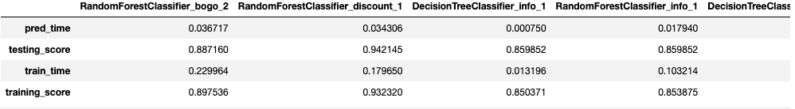

# Udacity_Data_Scientist_Capstone_Project
## Starbucks Capstone Challenge
Audacity Data Scientist Nanodegree Capstone project

### Table of Contents

1. [Introduction](#introduction)
2. [Installation](#installation)
3. [Project Motivation](#motivation)
4. [File Descriptions](#files)
5. [Results](#results)
6. [Licensing, Authors, and Acknowledgements](#licensing)

## 1.Introduction

This data set contains simulated data that mimics customer behavior on the Starbucks rewards mobile app. Once every few days, Starbucks sends out an offer to users of the mobile app. An offer can be merely an advertisement for a drink or an actual offer such as a discount or BOGO (buy one get one free). Some users might not receive any offer during certain weeks.

Not all users receive the same offer, and that is the challenge to solve with this data set.

Your task is to combine transaction, demographic and offer data to determine which demographic groups respond best to which offer type. This data set is a simplified version of the real Starbucks app because the underlying simulator only has one product whereas Starbucks actually sells dozens of products.

Every offer has a validity period before the offer expires. As an example, a BOGO offer might be valid for only 5 days. You'll see in the data set that informational offers have a validity period even though these ads are merely providing information about a product; for example, if an informational offer has 7 days of validity, you can assume the customer is feeling the influence of the offer for 7 days after receiving the advertisement.

You'll be given transactional data showing user purchases made on the app including the timestamp of purchase and the amount of money spent on a purchase. This transactional data also has a record for each offer that a user receives as well as a record for when a user actually views the offer. There are also records for when a user completes an offer.

Keep in mind as well that someone using the app might make a purchase through the app without having received an offer or seen an offer.

## 2.Installation

There should be no necessary libraries to run the code here beyond the Anaconda distribution of Python.  The code should run with no issues using Python versions 3.*.

## 3.Project Motivation

We are going to answer the following two questions:

1. What are the main features influencing the effectiveness of an offer on the Starbucks app?
2. Could the data provided, namely offer characteristics and user demographics, predict whether a user would take up an offer?

## 4.File Descriptions

The notebook available here showcases work related to the above questions. 

This data set is a simplified version of the real Starbucks app because the underlying simulator only has one product whereas Starbucks actually sells dozens of products.

The data is contained in three files:
- `portfolio.json` - containing offer ids and meta data about each offer (duration, type, etc.)
- `profile.json` - demographic data for each customer
- `transcript.json` - records for transactions, offers received, offers viewed, and offers completed

Here is the schema and explanation of each variable in the files:

`portfolio.json`
- id (string) - offer's id
- offer_type (string) - the type of offer as BOGO, discount, informational
- difficulty (int) - the minimum required to spend to complete an offer
- reward (int) - the reward is given for completing an offer
- duration (int) - time for the offer to be open, in days
- channels (list of strings) - offer that create via

`profile.json`
- age (int) - age of the customer
- became_member_on (int) - when customer create an app account
- gender (str) - gender of the customer (some entries contain 'O' for neither M or F)
- id (str) - customer's id
- income (float) - customer's income

`transcript.json`
- event (str) - record description (transaction, offer received, offer viewed, etc.)
- person (str) - customer's id
- time (int) - time in hours since the start of the test.
- value - (dict of strings) - either an offer id or transaction amount depending on the record

## 5.Results

The mai of the code can be found at [here](hhttps://github.com/NLkhuyen/Udacity_Data_Scientist_Capstone_Project).

### **Question 1:**
- The feature importance given by all 3 models were that the tenure of a member is the biggest predictor of the effectiveness of an offer.
- The top 3 variables were the same - membership tenure, income and age. However, income and age switched orders depending on offer type, for all three models.
- The distribution of feature importances were relatively equal with BOGO and discount offers. However, for informational offers, the distribution is slightly more balanced, with income the second most important variable.

### **Question 2:**

- Decision to use 3 separate models to predict the effectiveness of each offer type ended up with good accuracy for the BOGO and discount models (88.71% for BOGO and 94.21% for discount), while slightly less accurate performance for informational offers (around 85.98%). So there is no cost involved to inform users of a product.

- For BOGO and discount models, The 88% and above accuracy, as in a business setting that would be good enough to show offers to people, even if the model misclassifies a few, the overall revenue increase might justify the few mistakes.

### **Potential improvement**
- There should be more insight for the other cases where the customer finishes the transactions regardless of the offer. If we could get any insight into those cases, maybe we can send out more offers to those customers.

- Unsupervised learning on clustering the customers based on information we are given, to see if there are any specific characteristics on a group of customers who will be more likely to respond to the offer.

### **Other Result that founded**
- Male and Female almost equally complete the offer. So offers should be sent equally among them.
- The two most completed offer of type are 'BOGO' and 'Discount'. So these two should be sent to more people.
- People of age 50–70 of income between 60000–90000 respond most to offers type 'BOGO' and 'Discount'. So it will be good to send BOGO and Discount offers to these people

## 6.Licensing, Authors, Acknowledgements
Credit to Stakbucks for the data.